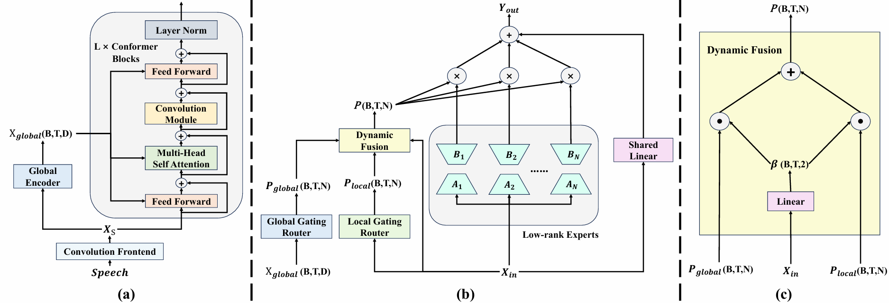

(简体中文|[English](./README.md))

# GLAD: Global-Local Aware Dynamic Mixture-of-Experts for Multi-Talker ASR

[Arxiv](https://arxiv.org/abs/2509.13093) | 
[Paper HTML](https://arxiv.org/html/2509.13093v4)

## 方法框架

GLAD（Global-Local Aware Dynamic Mixture-of-Experts）是一个旨在解决多说话人自动语音识别（Multi-Talker Speech Recognition, MTASR）重叠语音转录挑战的创新架构 。

- 近年来的研究表明，说话人特征在多说话人语音识别中起着至关重要的作用。在编码器中引入与说话人相关的信息，可以为重叠语音表示的解耦提供更强的指导，从而提升识别性能。
- 混合专家（MoE）范式通过条件计算处理输入的多样性，能够动态分配专门的专家来处理不同数量的说话人和不同程度的语音重叠，这种思路非常适合处理 MTASR 任务 。
- 然而，在深层网络中，用于区分说话人特征的判别性声学线索会逐渐被削弱，这使得传统的局部路由机制难以基于说话人特征进行有效的专家分配。为了解决这一问题，我们引入全局信息，以补充局部路由决策并增强专家选择能力。

因此，我们提出了下图所示的方法框架：

<p align="center">
  
</p>
<p align="center"><em>Figure: 提出的 GLAD-SOT 架构概览。(a) 全局线性编码器将来自卷积前端的特征转换为共享的全局表示，并将其广播到每个 MoLE 层。(b) 每个 MoLE 层从共享的全局表示中提取全局权重，并将其与局部信号结合，以协调低秩专家。(c) 全局-局部感知动态融合模块自适应地融合这些权重，以指导专家的选择。</em></p>

我们的贡献是：

- 据我们所知，这项工作代表了混合专家 (MoE) 架构在多说话人语音识别 (MTASR) 中的首次应用 。在 LibriSpeechMix 和 CH109 数据集上的广泛实验表明，我们的方法优于强大的基于 SOT 的基线模型，特别是在极具挑战性的 MTASR 场景中。
- 我们提出了 GLAD，这是一种新颖的机制，它能够动态地将来自浅层声学特征的说话人感知全局上下文与细粒度的局部特征相融合。这种双路径路由策略同时利用说话人身份线索和语音细节，从而指导专家解开重叠的语音。
- 我们提供了全面的消融实验来验证我们设计的有效性 。我们的分析表明，引入全局声学特征对于说话人感知的专家路由至关重要，特别是在区分说话人身份最为困难的高重叠场景中。详见我们的[论文](https://arxiv.org/abs/2509.13093)。

## 实验发现

- **全局路由和动态提取策略**：在我们的消融实验中，我们证明了我们提出的全局路由和动态混合全局局部特征是有效的。可以在原始MoE的基础上取得巨大的提升。
- **激活专家数量**：我们在三专家设置下进一步进行了实验，将路由 top-k 从 1 变化到 3。
  - 我们发现，当选择全部三个专家（top-k = 3）时取得了最佳性能。我们将这一现象归因于多说话人语音的内在复杂性=。在较小的 top-k 设置下，并且在负载均衡loss的约束=下，学习信号被迫分配到有限的专家子集中，这可能导致单个专家缺乏充分的专门化能力。结果是，每个专家只能接收到部分信息且较为碎片化的表示，从而限制了其对复杂重叠语音条件的建模能力。
  - 相比之下，更大的 top-k（即更“密集”的专家激活）允许多个专家共同参与同一输入的处理，从而实现更丰富的专家交互以及更全面的表示建模。这有助于更充分地利用互补的全局与局部声学线索，从而在复杂的重叠语音场景下提升模型的鲁棒性。


## 训练数据

步骤1：进入`traindata`目录，运行`run.sh`解压数据。解压后将生成`generate`和`traindata`两个目录。

步骤2：

- `generate`目录下包含两个标注文件：
    - `train-960-1mix.jsonl`：LibriSpeech-train-960
    - `train-960-2mix.jsonl`：通过混合两个说话人音频构建的双说话人数据。
- 使用[LibrispeechMix](https://github.com/NaoyukiKanda/LibriSpeechMix)工具生成混合音频。每条语音对应的文本以"text1"（单说话人）和"text1 $ text2"（双说话人）的形式表示，其中"$"表示说话人转换。

步骤3：

- `traindata`目录下包含
    - `wav.scp`：经espnet处理（经过0.9，1.0，1.1变速）生成的索引文件。这里我们给出`wav.scp`是明确我们对文件的命名格式。
    - `wavlist`：本次实验**训练数据**所使用的音频ID列表。
- 根据`wavlist`对步骤2中生成的音频进行过滤，得到本论文实验所需的训练数据。


## 使用GLAD

本项目基于[ESPnet](https://github.com/espnet/espnet)框架进行开发。

步骤1：将本仓库中espnet目录下的`egs2`，`espnet`，`espnet2`目录替换至官方[ESPnet](https://github.com/espnet/espnet)仓库对应目录中，并根据实际情况修改配置（如数据路径等）。


步骤2：准备好数据，运行[`run.sh`](./espnet/egs2/librispeech/asr1/run.sh)。请先运行run.sh脚本的数据处理阶段的stage，之后再运行stage10~stage13。

步骤3：利用[`run_pi_scoring.sh`](./espnet/egs2/librispeech/asr1/run_pi_scoring.sh)进行模型评估。评估代码参考自[Speaker-Aware-CTC](https://github.com/kjw11/Speaker-Aware-CTC)，感谢其开源支持。

## 联系我们
如有问题或合作意向，欢迎通过邮箱与我们联系：

guoyujie02@mail.nankai.edu.cn

## 引用
如果我们的工作或代码对您有所帮助，请考虑引用本项目对应论文，并对本项目并给予⭐支持。

```
@misc{guo2025gladgloballocalawaredynamic,
      title={GLAD: Global-Local Aware Dynamic Mixture-of-Experts for Multi-Talker ASR}, 
      author={Yujie Guo and Jiaming Zhou and Yuhang Jia and Shiwan Zhao and Yong Qin},
      year={2025},
      eprint={2509.13093},
      archivePrefix={arXiv},
      primaryClass={cs.SD},
      url={https://arxiv.org/abs/2509.13093}, 
}
```

## 致谢

本仓库是基于[ESPnet](https://github.com/espnet/espnet)框架。

部分实现参考并借鉴了以下开源项目，特此致谢：

- [LibrispeechMix](https://github.com/NaoyukiKanda/LibriSpeechMix)
- [Speaker-Aware-CTC](https://github.com/kjw11/Speaker-Aware-CTC)
- [CSEnet](https://github.com/kjw11/CSEnet-ASR)
